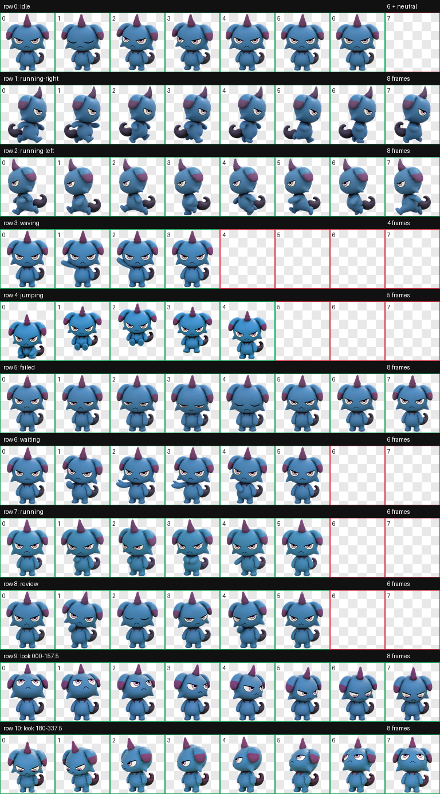
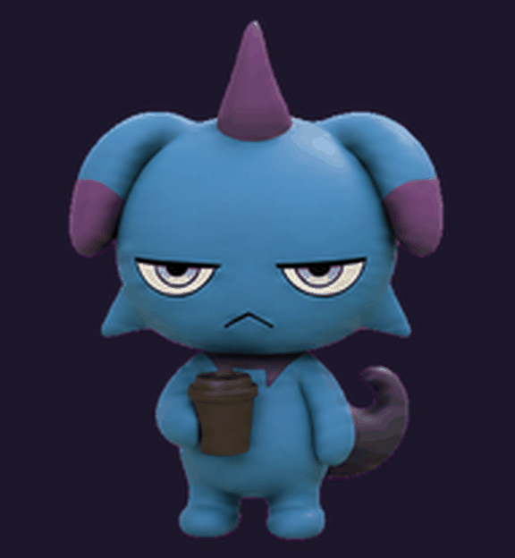

# Depresso for Codex

An unofficial, noncommercial Depresso pet for the ChatGPT desktop app and Codex CLI. Version 1.3.2 adds a tired coffee-sip loop for review moments, with a cache-busting sprite source so ChatGPT reloads the grounded reaction instead of an airborne jump.



### Shareable coffee break



Download [`depresso-coffee-break.gif`](media/depresso-coffee-break.gif) to share it in Slack, Discord, or any chat that supports GIFs.

## Install

### macOS or Linux

1. Download the latest release and unzip it.
2. In Terminal, run:

   ```sh
   ./install.sh
   ```

3. In the ChatGPT desktop app, open **Settings → Pets**, select **Refresh**, then choose **Depresso**. Use `/pet` to wake it.

Alternatively, copy the `depresso` folder to `~/.codex/pets/` yourself.

### Codex CLI

After installing, run `/pets depresso` in an interactive Codex CLI session.

## Compatibility

This is the full desktop/CLI sprite package (v2, `1536 × 2288`). It is not a ChatGPT web upload: web uploads currently require a `1536 × 1872` sprite sheet.

## Contents

- `depresso/pet.json` — Codex pet manifest
- `depresso/spritesheet.webp` — the animated transparent sprite sheet
- `install.sh` — a small installer for macOS/Linux

## Fan-content notice

This is an unofficial, noncommercial fan project. It is not affiliated with, endorsed by, or sponsored by Pocketpair.

`Palworld` and `Depresso` are property of their respective rights holders. The sprite sheet is independently created fan art; it does not include extracted or redistributed Palworld game assets. Use of the artwork is subject to Pocketpair's [Guidelines for Derivative Works](https://www.pocketpair.jp/en/guidelines-derivativework-en/).

The code and configuration files in this repository are licensed under MIT. The character artwork is excluded; see [ASSET-NOTICE.md](ASSET-NOTICE.md).
